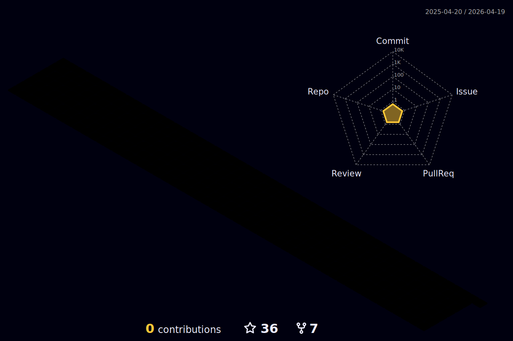

<br>
<br>

```RD - profile {

						 Bio

						 > Senai - desenv.sistemas - 3/3      <
						 > Estudando Hacking                  <
						 > Concept artist amateur             <
						 > Livro preferido: Inferno de dante  <
						 > Hq preferida: Sandman              <


```
<details>
  <summary >see more</summary>
<h4 align="center">

[](https://www.instagram.com/orealrodrigo/)
[](https://www.linkedin.com/in/rodrigo-s-a149a220b/)

</h4>

<h3 align="center" height="20" >GitHub Estatísticas:</h3>

 <div align="center">
   
  
	
  
  
</div>


  <div align="center">


 </div>

<h1 align="left" id="macropower-tech">Tech</h1>
> Programming/markup languages.

<p>
 <a href="https://github.com/search?q=user%3ADenverCoder1+language%3Ajavascript"></a>
    <a href="https://github.com/search?q=user%3ADenverCoder1+language%3Acss"></a>
    <a href="https://github.com/search?q=user%3ADenverCoder1+language%3Ahtml"></a>
    <a href="https://github.com/search?q=user%3ADenverCoder1+language%3Amarkdown"></a>
    <a href="https://github.com/search?q=user%3ADenverCoder1+language%3Aphp"></a>
    <a href="https://github.com/search?q=user%3ADenverCoder1+language%3Apython"></a>
    <a href="https://github.com/search?q=user%3ADenverCoder1+language%3Asass"></a>
</p>

> Frameworks and libraries.

<p>
    <a href="#"></a>
    <a href="#"></a>
    <a href="#"></a>
    <a href="#"></a>
    <a href="https://github.com/search?q=user%3ADenverCoder1+language%3Ajavascript"></a>

    
</p>

> Databases and cloud hosting.

<p>
    <a href="#"></a>
    <a href="#"></a>
</p>

> Software and tools.

<p>
    <a href="#"></a>
    <a href="#"></a>
    <a href="#"></a>
    <a href="#"></a>
    <a href="#"></a>
    <a href="#"></a>
    <a href="#"></a>
    <a href="#"></a>


</p>

> Os.

<p>
    <a href="#"></a>
    <a href="#"></a>
</p>


# TryHackMe

<details>
  <summary >see more</summary>	
  <div align="center">

</div>  
</details>


# Listening

<details>
  <summary >see more</summary>
<div align="center">
<!-- 
[](https://github.com/kittinan/spotify-github-profile) -->
	
 
	
# Contributions


</div>
</details>
</details>

  
