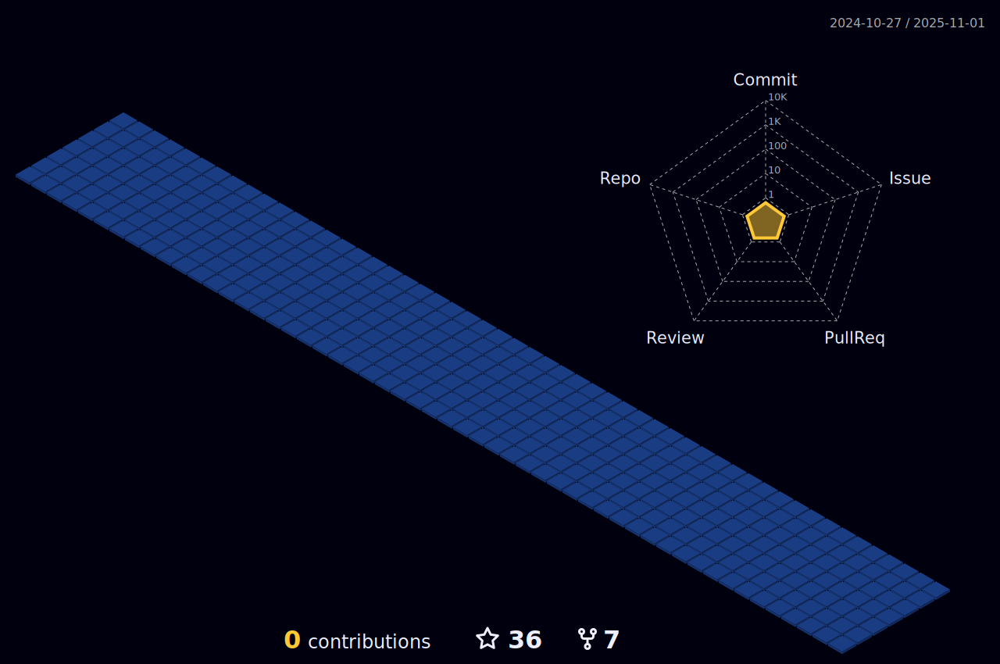

<!--    <details>
<summary>Abrakadabra</summary>
	
 <div align="center">
      
</div>  
 
   <h3 align="center" height="20" >GitHub Estatísticas:</h3>

 <div align="center">
  
   
  
  
</div>

	
	
<!--  ## <🛠> ᴛᴇᴄʜ ꜱᴛᴀᴄᴋ </🛠>
| **PROPERTY** | **DATA** |
| --- | --- |
| **Language/IDE** |  |
| **Database** | |
| **OS** |     |
| **Tools & Platform** |    | -->

  <div align="center">


 </div>
	
   <h3 align="center" height="20" >Linguagens e Ferramentas:</h3>
	
				 
				 
  <div style="display: inline_block;" align="center"><br>
  
  
  
  
  
  
  
  
  
  
  
  
  
  
  
  


</div> 

# Contributions



<div align="center">
<!-- 
[](https://github.com/kittinan/spotify-github-profile) -->
	


	
</div>

```RD
#include <stdio.h>
int main( ) {

int r;

printf( "Eu tenho em minhas mãos os meios e, em meu coração, a vontade.");
c = getchar( );

printf( "Yagami Raito");
   putchar( r );

   return 0;
}
```


	   
	   
</details> 
	   
 
