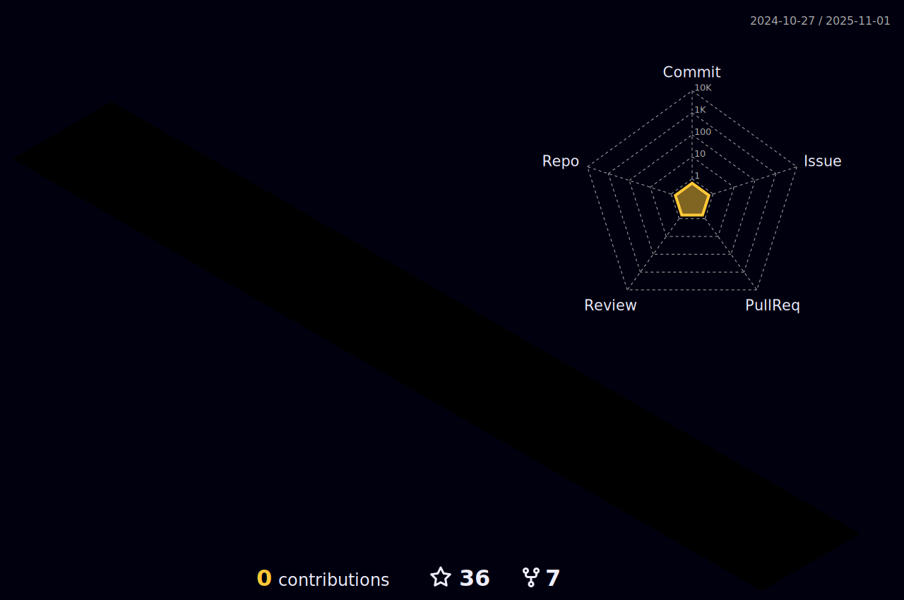

  
  

<table align="center">
  <tr>
    <td align="center" width="96">
        
       React
    </td>
    <td align="center" width="96">
      
       Python
    </td>
    <td align="center" width="96">
        
       JavaScript
    </td>
    <td align="center" width="96">
        
       Webpack
    </td>
    <td align="center" width="96">
        
       MySQL
    </td>
    <td align="center" width="96">
        
       TypeScript
    </td>
    <td align="center" width="96">
        
       AWS
    </td>
    <td align="center" width="96">
        
       C#
    </td>
  </tr>
  <tr>
    <td align="center" width="96">
        
       Github
    </td>
    <td align="center" width="96"> 
        
       Git
    </td>
    <td align="center"  width="96">
        
       Laravel
    </td>
    <td align="center" width="96">
        
       Tailwind
    </td>
    <td align="center" width="96">
        
       jQuery
    </td>
                <td align="center" width="96">
        
       Java
    </td>
              <td align="center" width="96">
        
       Sass
    </td>
    <td align="center" width="96">
        
       Firebase
    </td>
  </tr>
 <tr>
      <td align="center" width="96">
        
       MongoDB
    </td>
        <td align="center" width="96">
        
       Nodejs
      </td>
      </td>
    <td align="center" width="96">
        
       PHP
    </td>
              <td align="center" width="96">
        
       Linux
    </td>
 </tr>
</table>

 

